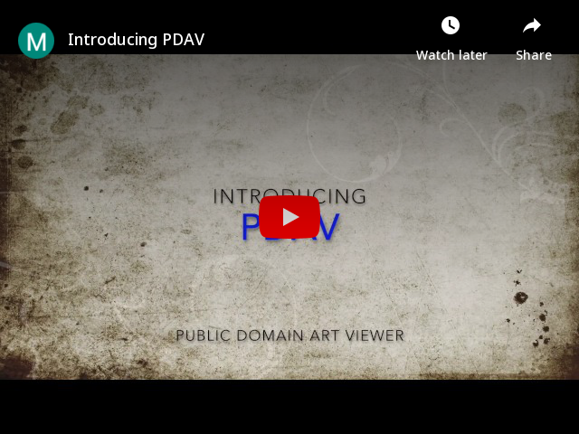

# Public Domain Art Viewer (PDAV)
Offline first / Desktop first - Art Fascinator

[](https://www.youtube.com/embed/EKm3znFJUaQ "Introducing PDAV")

## Download
[Windows](Windows/pdav.exe?raw=true) Mac Linux


## How to use
```
Click and drag to move
Right-click for art menu
Double-click to launch art source's page, if available
Reset image tools by moving cursor outside
Keys: arrows to advance art, spacebar to pause, p or ? for plaque, d for directory, esc to exit
```

## Optional Switches
```
-h, --help Help
-d, --download_all Downloads all files in current source
-c, --collection Specifies collection
-a, --authority_file Uses an alternate authority
```


